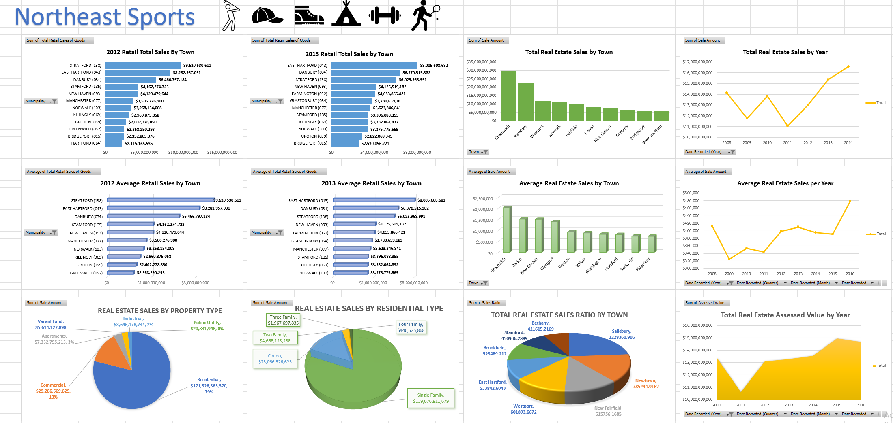

# Northeast Store Expansion

Will be done on after April 16th 2022 ( Under Construction )

This project was done in my Advanced Excel class I took at a community college. This project is that I am a store owner called Northeast Sports and I want to pick the 5 best towns in connect open a new store. The dataset that is used is the 2012 Retail Sales, 2013 Retail Sales, and 2001-2018 Real Estate Sales. The dataset is in the data model and not in the worksheet due to the large storage of those datasets. To find the 5 best towns, I am going to come up with 12 Key Performance Indicators.

The 12 KPIs that I created that will help find the 5 best towns to open a new store: 

1. Retail Sales by Town in 2012, 
2. Retail Sales by Town in 2013, 
3. Real Estate Sales by Property Type, 
4. Real Estate Sales by Residential Type, 
5. Total Real Estate Sales by Town, 
6. Total Assessed Real Estate Value by Year, 
7. Real Estate Sales Ratio by Town, 
8. Total Real Estate Sales by Year, 
9. Average Real Estate Sales by Town, 
10. Average Real Estate Sales by Year, 
11. Average Retail Sales by Town in 2012, 
12. Average Retail Sales by Town in 2013.

For each KPI, PivotTables are created to see the patterns and trends. And then pivot charts will be created and then put into a dashboard to see more patterns and trends. Every KPI has a pivot table and a slicer to filter the data. I want to use the top retail total and average per town and real estate sales see if there’s overlap if there is, how much is it. The higher the sales and real estate sales, the more likely that town will be chosen.

## Retail Sales by Town in 2012 

The first KPI that is chosen is the total retail sales by town in 2012. This KPI determines the total retail sales in each town. The total retail sales are sorted by each town. The KPI is filter to the top 10 towns with the highest retail total sales. This means that Stratford is the highest performing town in Connecticut in 2012.

I also wanted to figure out whether the stores in thoses towns are high perfominhg. I then create a lookup table named Performance by Town and I sorted the the total sales into four categories. The categories are Low, Acceptable, Good and Exceleent. The excellent performing towns are the towns I want to expand to a new store.

### Store Performance in Each Town

I also wanted to figure out whether the stores in those towns are high performing. VLOOKUP is used. The lookup table has been created from scratch. It was not provided on the dataset. The columns created in the KPI worksheets was also not provided so it was created from scratch. I created a lookup table named Performance by Town with named range Performance and I sorted the total sales into four categories. The categories are Low, Acceptable, Good and Excellent. The excellent performing towns are the towns I want to expand to a new store. The lookup value is the cell the first cell in the total retail sales of goods column that I want to use. I count how many rows are in the PivotTable. I will split the count of retail sales of goods rows being used into fours.  I then put it in descending order. For example, for a low performer, I will put $1 into the lookup table in the level low. Then I put $160,000,000 in the acceptable. This means that any number between $1 and $160,000,000 will display a level meaning low. This mean the store in that town is a low performer. $160,000,000 and above will display as acceptable. The numbers in the lookup table are the minimum number that it displays the level and the higher the number, the more the level stays as is unless you put another minimum number on the lookup table. I will do this for levels of acceptable, good, and excellent.

After the function is set which is =VLOOKUP(B5,Performance,2,TRUE). Each town displays a store performance. For example, Store Performance in Hartford is Excellent. Store Performance in Brookfield is good. Store performance in Bethel is acceptable. Store performance in Bridgewater is low.

I will filter this by the top 10 towns

Any town with the performance of excellent will be used to choose the 5 best towns to open up a new store.

## Retail Sales by Town in 2013

This KPI is the same as the first KPI but in year 2013. The filtering is the same. East Hartford is the highest performing Town.
Vlookup is uesd. The lookup table has been created from scratch. It was not provided on the dataset The cloums created was also not provided so it was created from scratch.

I also wanted to figure out whether the stores in thoses towns are high perfominhg. I then create a lookup table named Performance by Town and I sorted the the total sales into four categories. The categories are Low, Acceptable, Good and Exceleent. The excellent performing towns are the towns I want to expand to a new store.

### Store Performance in Each Town
I also wanted to figure out whether the stores in those towns are high performing. The process is the same as the 2012 Retail Sales KPI. VLOOKUP is used. The lookup table has been created from scratch. It was not provided on the dataset. The columns created in the KPI worksheets was also not provided so it was created from scratch.

After the function is set which is =VLOOKUP(B5,Performance,2,TRUE). Each town displays a store performance. For example, Store Performance in Bristol is Excellent. Store Performance in Cromwell is good. Store performance in Canton is acceptable. Store performance in Canaan is low.

I will filter this by the top 10 towns

Any town with the performance of excellent will be used to choose the 5 best towns to open up a new store.

## Real Estate Sales by Property Type

This KPI determines the most expensive property type for all the towns. Residential is the most expensive property type. Then commercial than apartments. Therefore, the property type where people are living such as residential and apartments will be a big priority to find the most expensive town.

## Real Estate Sales by Residential Type

This KPI determine the most expensive type of houses for all the towns. Single family homes are the most expensive type of housing, Then condos then two family, three and four family houses.

## Total Real Estate Sales by Town

The third KPI is determines the highest total real estate sales in each town. This gives a clue on whether a town is expensive. When a town is expensive, people in those towns have more money, therefore would spend more money. Thye graphs are filtered by the top ten towns with the most real estate sales. Greenwich is the most expensive town. 

I want to figure out with a toen is expenisive or cheap. I also wanted to figure out whether the stores in thoses towns are high perfominhg. I then create a lookup table named  Town’s home valueand I sorted the the total sales into four categories. The categories are Low, Acceptable, Good and Exceleent. 

The excellent performing towns are the towns I want to expand to a new store.

## Total Assessed Real Estate Value by Year KPI

The assessed value is the value that the properties get before the sales have been completed. This KPI determines if towns are getting more expensive before completed the sales. The assessed value has been trending upward. This gives first impressions on whether a town is expensive or cheap place to live. This upward trend means the towns in Connecticut are getting more expensive.

## Real Estate Sales Ratio by Town

Sales Ratio is way of measuring accuracy of the property assessed value when compared to the property’s selling price. It is useful to discover but I will not include in my decision making to pick the best town. I don’t believe that real estate agents will get people to buy homes that are way lower in value in a town that has very high value.  It is not like people are buying a home for $100,000 in a town where houses are worth at least $5,000,000. Therefore, will not be included in decision making.

## Total Real Estate Sales by Year

This KPI determines the total real estate sales for all the towns by year after the real estate sales has been completed. This determine where Connecticut is becoming an expensive place to purchasing a home in. Since 2011 the sales have been trending upward therefore all the towns in Connecticut. became more expensive. 

## Average Real Estate Sales by Town

This determines the . If the average total realst estate is high

## Average Real Estate Sales by Year

This KPI is th average real estate sales of all the towns by year. The trend is going up. This means all towns are getting more expensive. Because sits the average it means higher average means its will stay consisitenly more expensive. The has been trending

## Average Retail Sales by Town in 2012

This KPI determine the average retail sales in 2012. If the retail average sales are high, that means the store in that town is consistently a high performer. If the retail average sales are low, that mean the store in the town is consistently a low performer. New stores will not open in towns that have the lowest retail average sales. Stratford has the highest average retail sales in 2012. 

## Average Retail Sales by Town in 2013

This KPI determine the average retail sales in 2013. If the retail average sales are high, that means the store in that town is consistently a high performer. If the retail average sales are low, that mean the store in the town is consistently a low performer. New stores will not open in towns that have the lowest retail average sales. East Hartford has the highest average retail sales in 2013. 

## What If Scenario for Average Real Estate Sales by Year

This is the what if scenario for the average real estate sales starting in 2010. Cell $B$16 is the year 2010. The highlights area is area the scenario happens. The first column is the current Average Real Estate Sales. The first scenario is what if the average real estate sales increased in 2010 therefore the towns became more expensive to live in which is the column named Average Real Estate Sales by Year Increase.  Another scenario is that what if the average real estate sales decreased in 2010 going forward therefore the towns became more cheaper to live in which is the column named Average Real Estate Sales by Year Decrease. The increased scenario can happen if companies that pay lots of money go to Connecticut. The decrease scenario happens if high paying jobs leave Connecticut. These scenarios can change plans in whether to open 5 new stores in Connecticut, open more, open less, or not open store at all.

## Dashboard

## Solutions

The 5 towns that will be chose
The five towns that will be chosen will be in the order of priority.

### Stamford
The best town to pick is Stamford. Stamford is the town that is near the top in both retail sales and real estate sales. It is one of the most expensive towns and the high total and average real estate sales shows that people here have money and will spend money. Stamford has always constantly a more expensive city therefore, people have always had more money and will spend it for many years to come. Stamford is a great first choice to open a new location.

### Danbury
Another town to pick is Danbury. Danbury is in the top 3 in total and average retail sales. Danbury is not as expensive as Stamford. So, Stamford gets a slight edge because its constantly more expensive because Stamford has a higher average real estate sale. Danbury has a chance to slightly underperform in the future if Danbury becomes cheap place to live. But the high total and average sales proved that it will not happen anytime soon. That is why Danbury is the 2nd choice to open a new location.

### Norwalk
Norwalk will be another town to pick. Norwalk is in the top 10 in both total and average retail sales. Norwalk is in the top five in toral real estate sales therefore it is expensive town and people have money. Because Norwalk has a lower average real estate sale. There is a chance of the store in that town to underperform if Norwalk becomes a cheap town to live which can happen. Because it is in the top 8, it will not happen right away. Therefore, Norwalk is the 3rd choice to open a new location.

### Greenwich
Greenwich will be another town to pick. Greenwich is the most expensive town in Connecticut. Greenwich also has the highest average real estate sales so Greenwich will stay expensive for years to come. People in that town have a lot of money to spend. Greenwich stores are performing well but not like the top 4 stores in the towns that was listed. This means not everyone in Greenwich will spend money at a sports store. Greenwich on the retail sales list proves that Greenwich has the potential to have highest total and average retail sales in the future. Therefore, Greenwich is a good 4th choice to open a new location.

### Bridgeport
Bridgeport is another town to pick. The total and average retail sales is in the top ten. It is the top ten in total real estate sales, so it is an expensive town. The average real estate sales in not high so the town can get cheap eventually. Bridgeport has a chance to underperform but not badly to the point where there is no need for expansion. That is why Bridgeport is 5th choice to open a new location.
The total and average retail estate sales started to trend upwards since so the all the towns will become more expensive. Will not focus on past 2016 because 2012 and 2013 years are a priority because that is the years the retail sales data is in. So that is the five towns that is chosen to open a new store in
